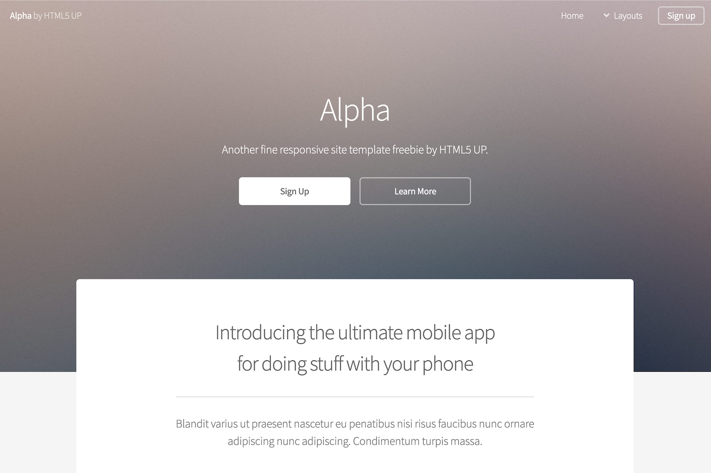

 # Hugo HTML5up Alpha
 
Hugo HTML5up Alpha is a port of the [Alpha by HTML5 UP](https://html5up.net/alpha) template. It is designed to mirror the look and feel of the original template as closely as possible, while taking advantage of all the best features Hugo has to offer. 
 
 
 
 ## Features
 
 Theme supports pages, page bundles, menus, sections, taxonomies, and base templates.
 
 ## Demo
 
 https://hugo-html5up-alpha.nelsonroberto.com/
 
 ## Setup
 
 ### Configuration
 
 See the demo's configuration as an example:
 
 https://github.com/dewittn/hugo-html5up-alpha/blob/master/exampleSite/config/config.toml
 
 #### Hugo Internal Templates
 
 The theme currently also supports the following ["internal templates" supplied by Hugo](https://gohugo.io/templates/internal/)
 
  - [Disqus](https://gohugo.io/templates/internal/#disqus)
  - [Google Analytics](https://gohugo.io/templates/internal/#configure-google-analytics)
 
 ### Cover Image
 
 The cover image URL is hard-coded, therefore to replace this add an image to the following location in your Hugo application:
 
 ```
 /static/images/banner.jpg
 ```
 
 ## Development
  
 ### Running Locally

 ```
 $ cd exampleSite && hugo server --themesDir ../..
 ```
 
 ## Original Theme Credits
 
  - [Alpha by HTML5 UP](https://html5up.net/alpha)
 
  ## License
 
 This hugo theme is licensed under the [Creative Commons Attribution 3.0 License](https://creativecommons.org/licenses/by/3.0/). 
 
 Read More - [LICENSE](LICENSE)

